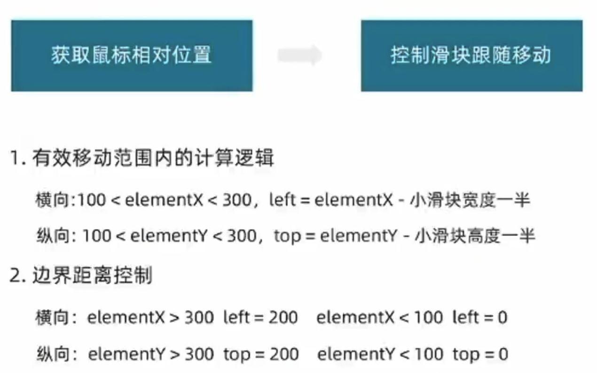
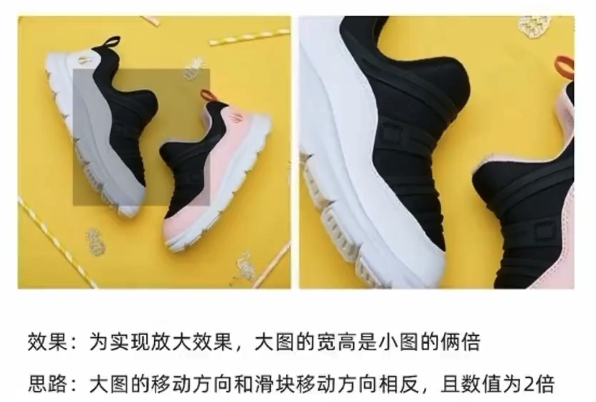

## 放大镜效果

### 滑块跟随鼠标移动

- 思路：
- - 获取当前的鼠标在盒子内的相对位置（useMouseInElement），控制货快跟随鼠标移动（left/top）
    

1. 有效移动范围内的计算逻辑

- - 横向：100 < elementX < 300，left = elementX - 滑块宽度一半
- - 纵向：100 < elementY < 300，top = elementY - 滑块高度一半

2. 边界距离控制

- - 横向：elementX > 300, left = 200; elementX < 100, left = 0
- - 纵向：elementY > 300, left = 200; element < 100, left = 0

### 放大图片显示

### 项目访问地址
http://134.175.232.176/
